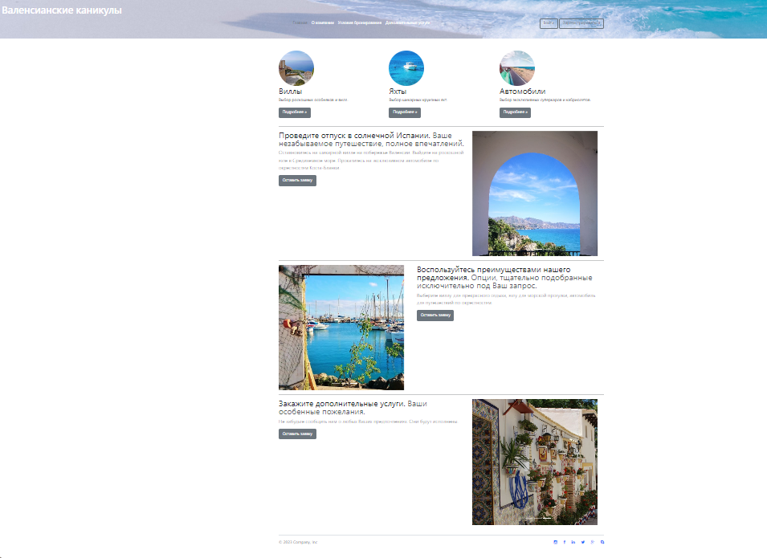

# plekhanov_university_diploma: final_assessment_project_django
Web приложение для бронирования путешествия.  
Вывод списка объектов трех основных моделей и трех связанных с ними моделей.  
API основных моделей.  
Вывод каждого из объектов основных моделей и определенных полей, связанных с ними дополнительных моделей на отдельную страницу.  
Формы добавления, редактирования, обновления объектов трех основных моделей.  
Корзина, позволяющая бронировать объект на определенное количество дней.  
Тестирование приложения.  
Администрирование сайта.  
Фронтенд: CSS, Bootstrap  

