# Valencian Vacation: Plekhanov Uuniversity Final Assesment Diploma Django Project 2023

### Description
A web application for booking travel experiences such as villas, yachts, and vehicles. Includes a cart system that allows users to select objects for a chosen number of days and automatically calculates the total order cost.

### Quick start via Docker
```bash
git clone https://github.com/yourusername/django_final_assessment_plekhanova_university.git
cd django_final_assessment_plekhanova_university
cp example.env .env
docker-compose up --build
docker-compose exec web python manage.py migrate
docker-compose exec web python manage.py createsuperuser
```
Enjoy!

### API Documentation
    • Swagger UI: http://localhost:8000/swagger/
    • Redoc: http://localhost:8000/redoc/

### Key Features
    • User registration & authentication via Djoser
    • Django admin panel for managing data at http://localhost:8000/admin/
    • Fully documented REST API
    • Data storage using PostgreSQL
    • Built-in pgAdmin interface for managing the database at http://localhost:5050
    • Catalogue list view and detail view for villas, yachts & vehicles
    • Add/edit/delete access to listings for authenticated users
    • Cart functionality with day-based pricing and total order calculation — available for authenticated users
    • Frontend styled with CSS and Bootstrap

### Pages
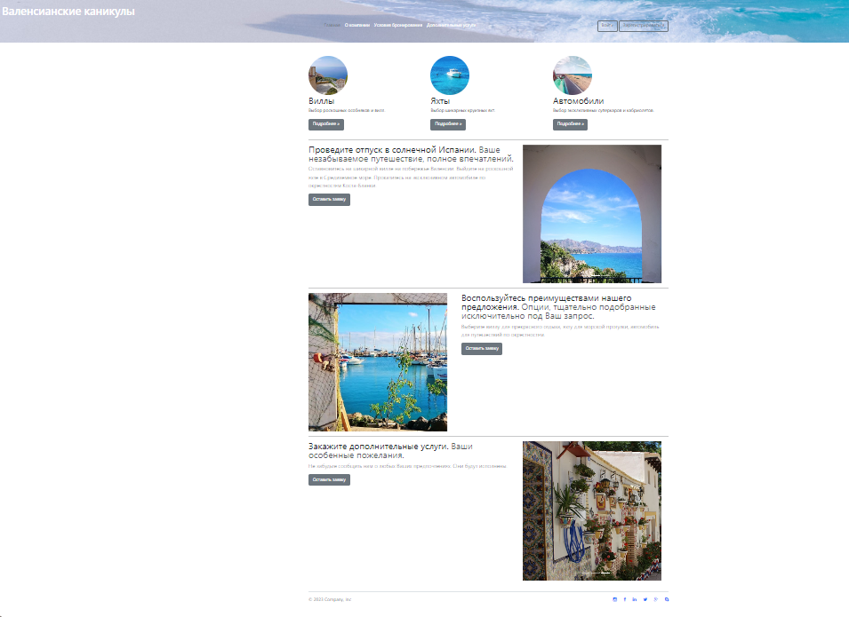
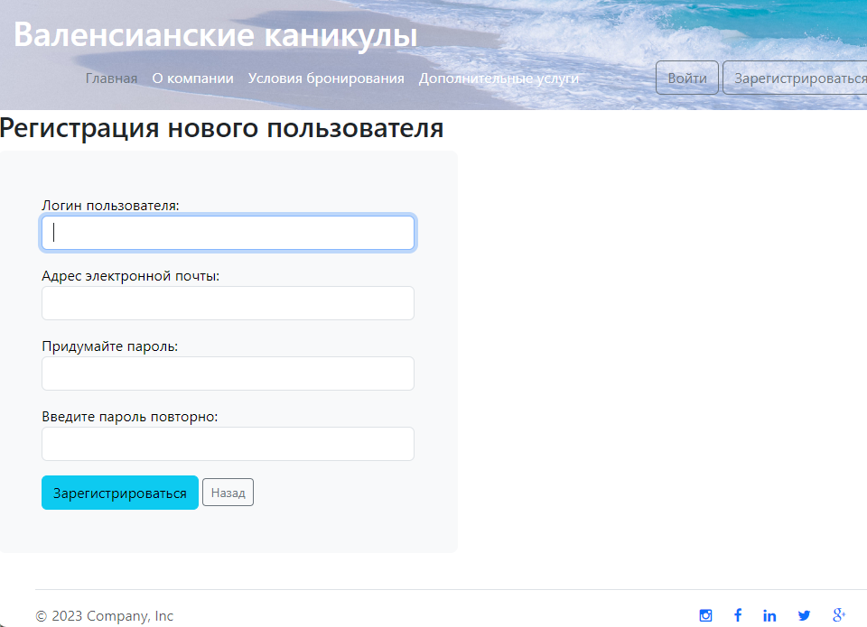
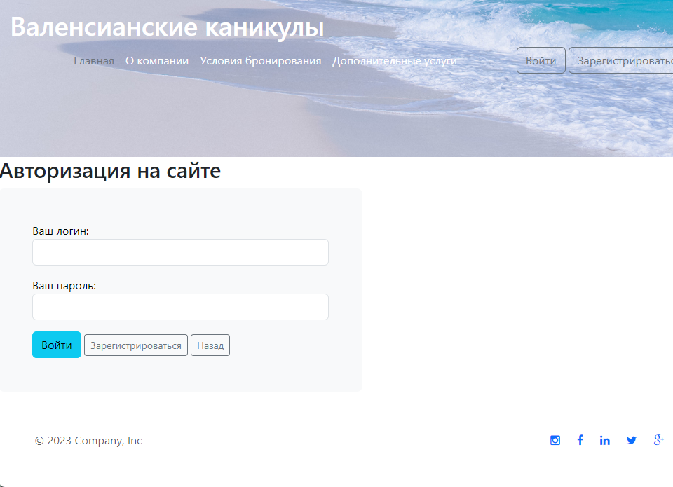
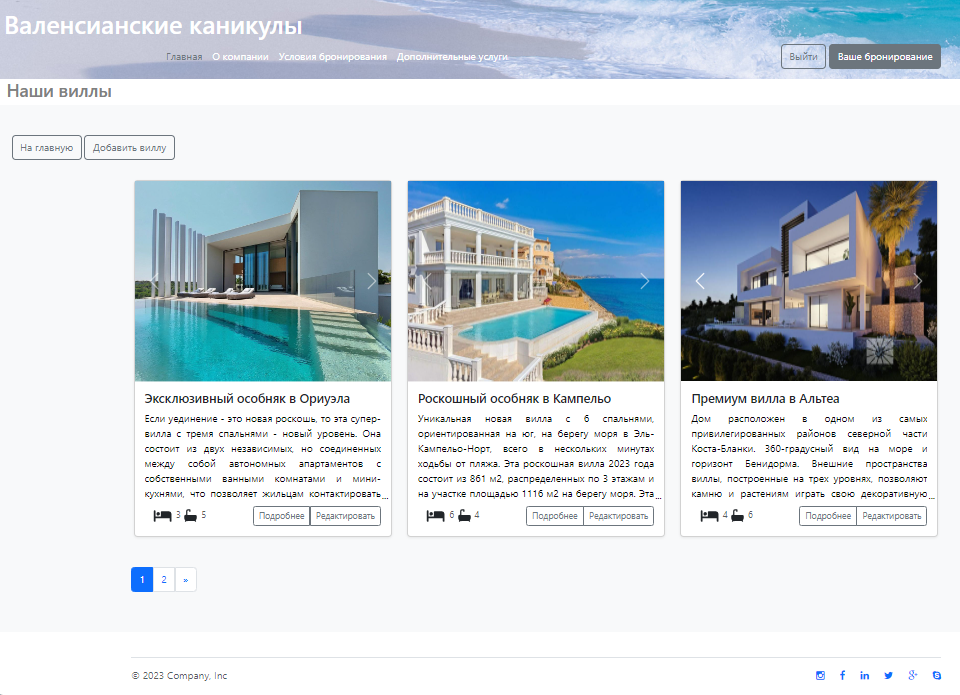
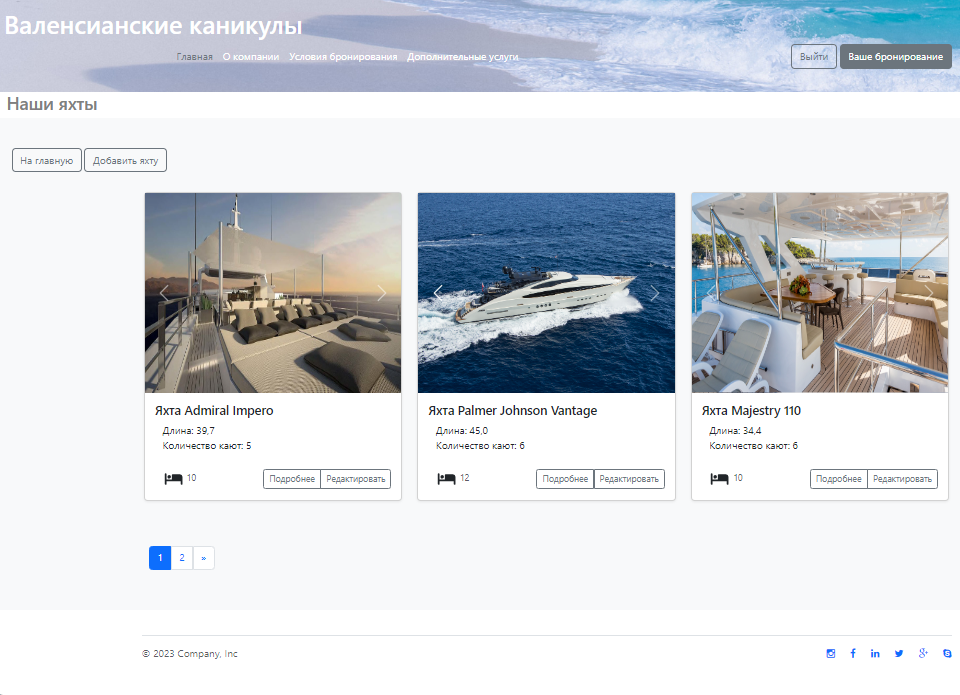
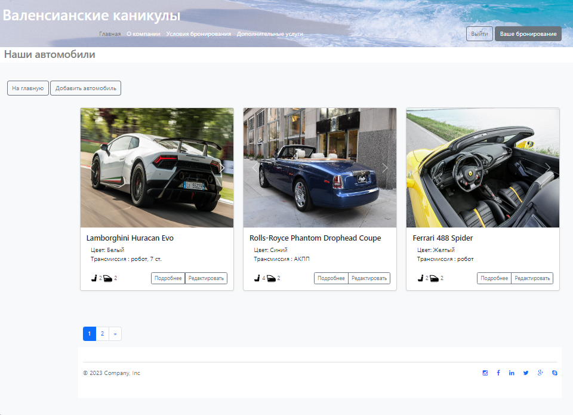
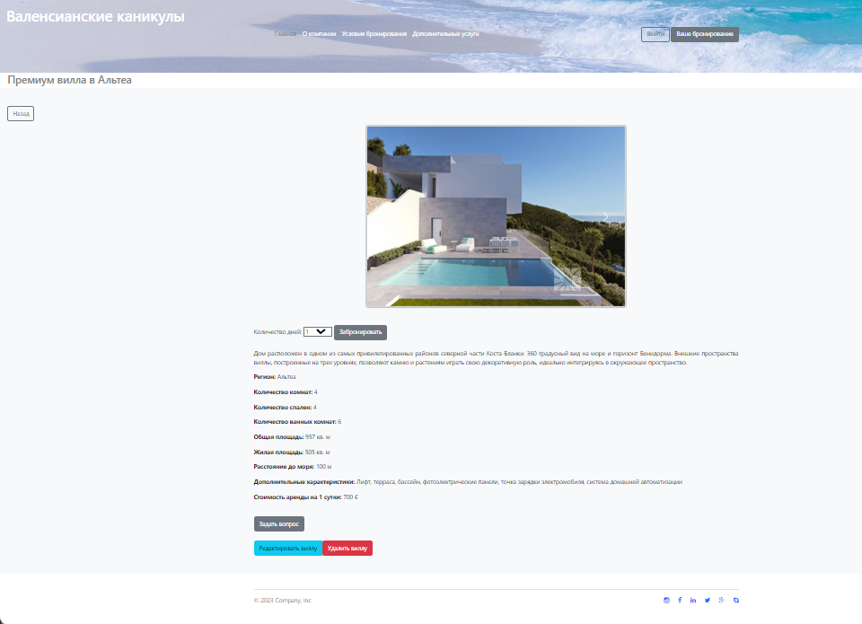
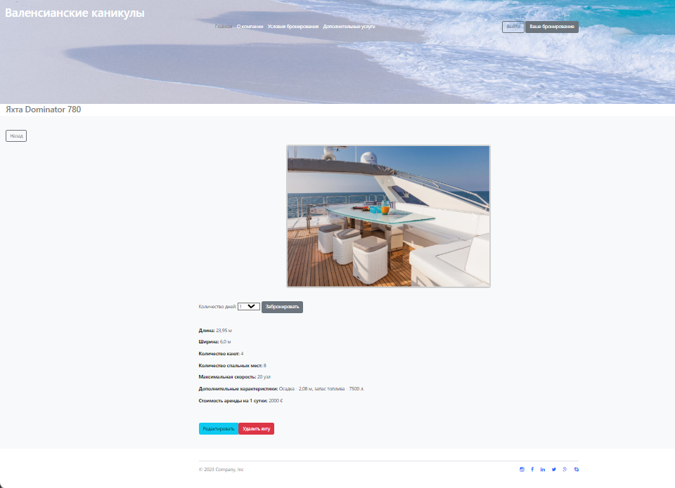
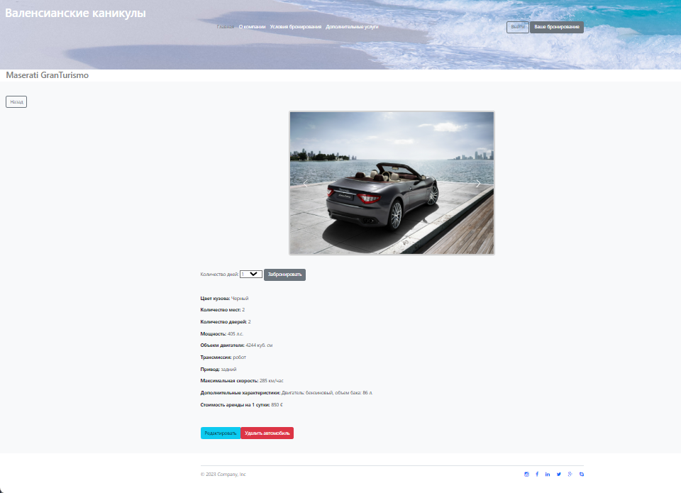
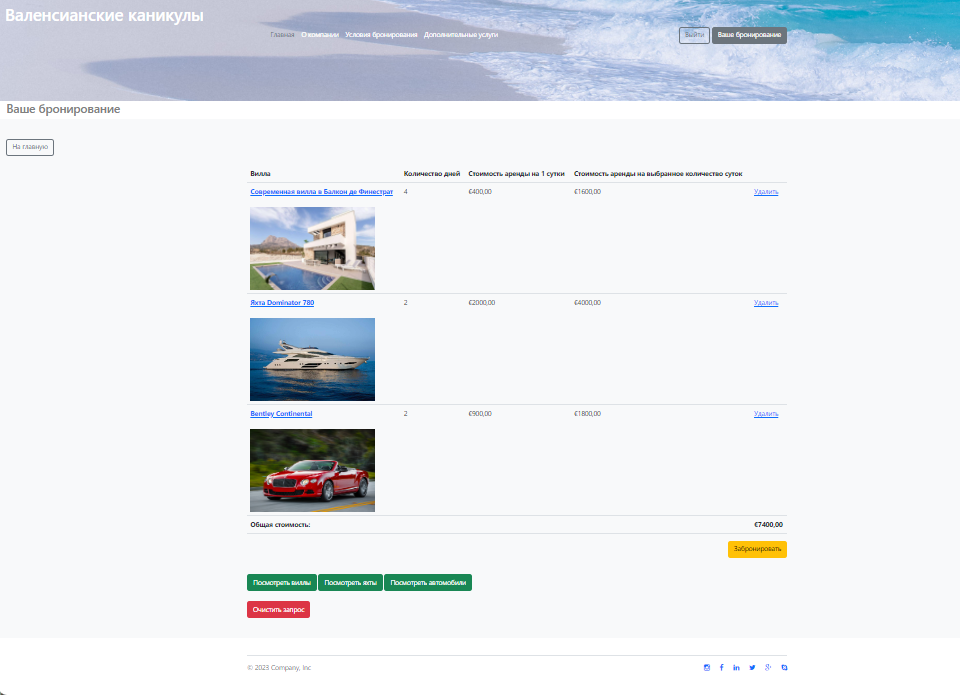
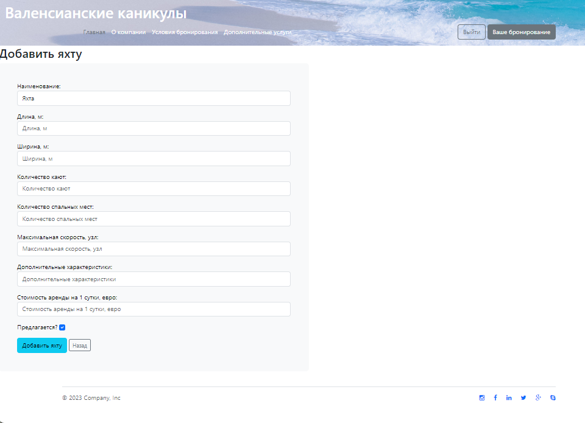
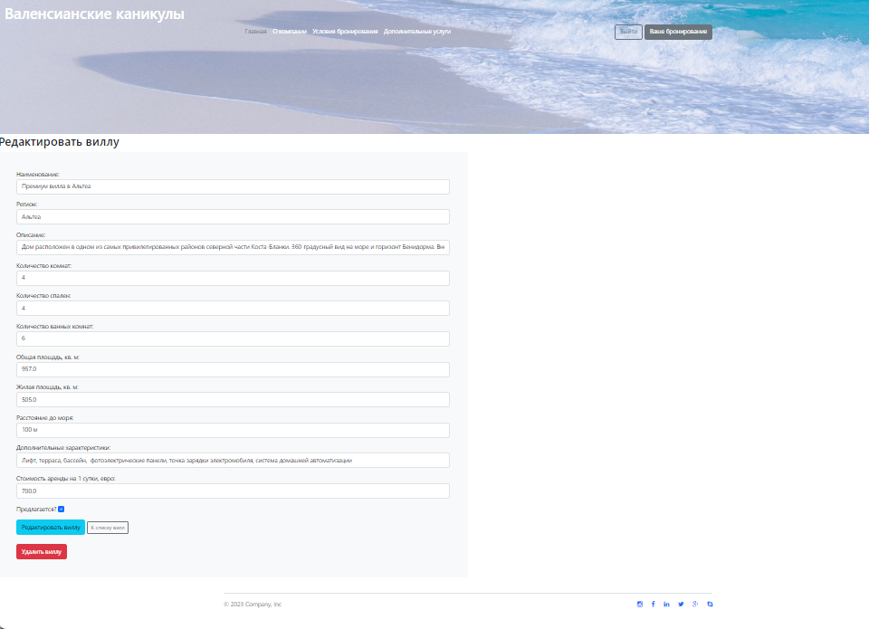
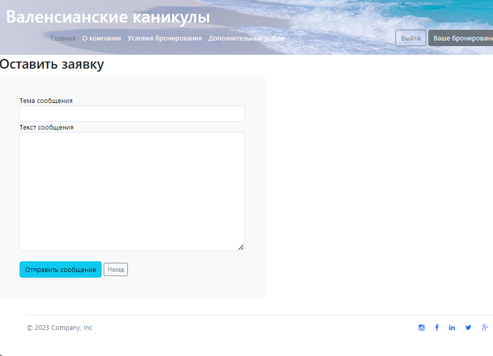
